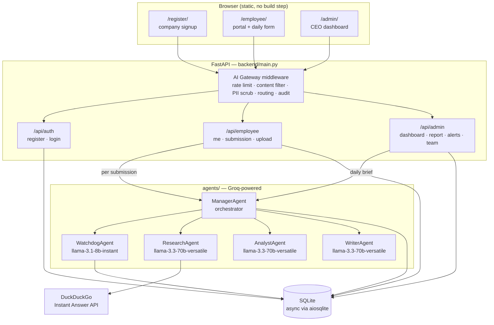
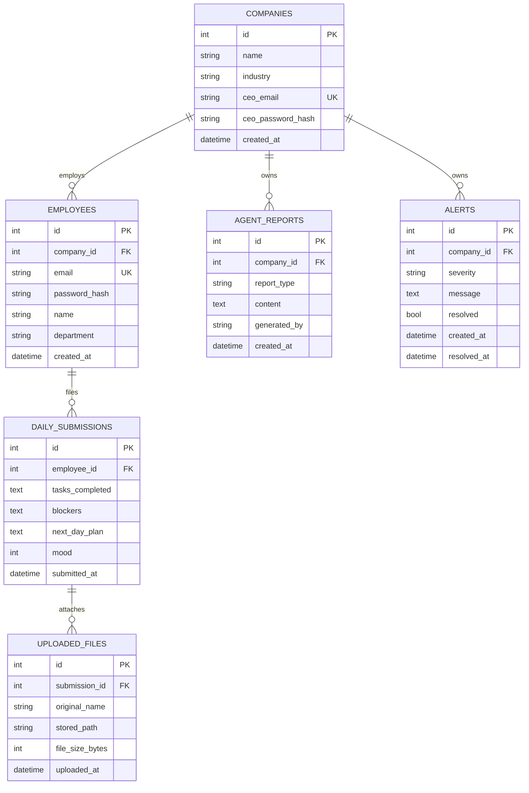

<div align="center">

# WitnessMate

### A multi-agent operating layer for daily team intelligence

Employees file a two-minute check-in. Five Groq-powered agents read it, score it,
cross-reference the market, and hand the CEO a written brief before the coffee gets cold.

<p>


</p>

</div>

---

## Table of contents

- [What this is](#what-this-is)
- [Why it exists](#why-it-exists)
- [Architecture](#architecture)
- [The agent roster](#the-agent-roster)
- [The AI Gateway](#the-ai-gateway)
- [Quickstart](#quickstart)
- [Configuration](#configuration)
- [Using the system](#using-the-system)
- [API reference](#api-reference)
- [Data model](#data-model)
- [Project structure](#project-structure)
- [Reconfiguring for a different industry](#reconfiguring-for-a-different-industry)
- [Known gaps and roadmap](#known-gaps-and-roadmap)
- [Tech stack](#tech-stack)

---

## What this is

WitnessMate is a **multi-tenant SaaS skeleton** for turning daily employee check-ins into
executive intelligence. It ships as a single FastAPI application with two front ends and a
five-agent backend:

| Surface | Who uses it | What it does |
| --- | --- | --- |
| **Company registration** (`/register/`) | Founders / CEOs | Self-serve signup that creates a company + admin account |
| **Employee portal** (`/employee/`) | Every employee | One daily status form, one file drop, one mood score |
| **Admin dashboard** (`/admin/`) | The CEO | KPIs, live alerts, per-person team status, and a generated daily brief |
| **Agent pipeline** (`agents/`) | The system itself | Inspects submissions, scans for risk, researches the market, writes the brief |

Every row in the database is scoped to a `company_id`, and every JWT carries it — so one
deployment can host many companies without them ever seeing each other's data.

---

## Why it exists

Status meetings are expensive and status reports are unread. The bet here is that the
useful signal in a team's day is already being typed into a form somewhere — it just never
gets aggregated, risk-checked, or contextualised.

WitnessMate closes that loop:

1. **Capture** — a short structured form, one per employee per day (enforced).
2. **Guard** — an LLM watchdog reads each submission before it is stored and can pass,
   flag, or block it.
3. **Aggregate** — direct SQL rolls up headcount, submission rate, and average morale.
4. **Contextualise** — a research agent pulls current industry news via web search.
5. **Narrate** — a writer agent turns all of the above into a markdown executive brief,
   grounded in the actual text employees wrote.

---

## Architecture



### The two flows that matter

**Employee submits a check-in** — `POST /api/employee/submission`

```
Gateway (rate limit → content filter → PII scrub)
   └─ router enforces "one submission per day"
        └─ ManagerAgent.handle_employee_submission()
             └─ WatchdogAgent.inspect_submission()  → { action, reason, urgency_score }
                  ├─ "block" → 400 + critical alert written to alerts
                  ├─ "flag"  → stored + medium alert raised for the manager
                  └─ "pass"  → stored, cheerful message returned
```

**CEO requests the daily brief** — `GET /api/admin/report/daily`

```
ManagerAgent.run_daily_pipeline(company_id)
   ├─ SQL: headcount, submissions today, average morale
   ├─ SQL: the actual text of today's submissions (so the writer has substance)
   ├─ ResearchAgent.gather_intelligence()   → agentic web_search loop → market brief
   ├─ WatchdogAgent.check_for_alerts()      → threshold scan → persists new alerts
   ├─ WriterAgent.compose_report()          → markdown brief, sections from YAML
   └─ persists to agent_reports, returns { report_id, content, kpis, alert_count }
```

---

## The agent roster

| Agent | Model | Tools | Job |
| --- | --- | --- | --- |
| **Manager** | — (pure orchestration) | — | Owns both public entry points. Fans out to the specialists, sequences them, persists the result. |
| **Watchdog** | `llama-3.1-8b-instant` (inline) | `database_query`, `alert_sender` | Two modes: a fast per-submission compliance verdict (`pass` / `flag` / `block` + urgency score), and a deterministic daily threshold scan that raises alerts. |
| **Research** | `llama-3.3-70b-versatile` | `web_search` | Runs a real tool-use loop: the model issues searches, reads snippets, and writes a cited markdown market brief. Backed by the keyless DuckDuckGo Instant Answer API — swap `_web_search_impl()` for Tavily/Serper/Brave in production. |
| **Analyst** | `llama-3.3-70b-versatile` | `database_query` | A guarded SQL agent. It is handed the exact schema and a `company_id` filter, loops up to 5 tool calls, and returns KPIs as strict JSON. Only `SELECT` is executable. |
| **Writer** | `llama-3.3-70b-versatile` | — | Single-shot composition. Takes KPIs + raw submissions + alerts + market brief and emits the executive brief, with section order driven by YAML. |

**On safety of the SQL agent:** `_run_db_query()` rejects anything that does not start with
`SELECT`, and the prompt hard-codes the `company_id` filter. It is a guardrail, not a
sandbox — see [Known gaps](#known-gaps-and-roadmap).

**On determinism:** the daily alert scan deliberately does *not* ask an LLM whether morale
is low. It computes `AVG(mood)` and a missed-submission percentage in SQL and compares them
to thresholds from the YAML config. LLMs write the prose; SQL owns the numbers.

---

## The AI Gateway

`backend/middleware/ai_gateway.py` is Starlette middleware that every API request passes
through, in this order:

| # | Stage | Behaviour |
| --- | --- | --- |
| 1 | **Rate limiting** | In-memory sliding 60s window, keyed on the `Authorization` header (falling back to client IP). Default **20 req/min/user**, from YAML. Exceeded → `429`. |
| 2 | **Content filtering** | Regex block-list over JSON request bodies. A match → `400` with a policy message, before anything is stored or sent to a model. |
| 3 | **PII scrubbing** | Emails, phone numbers, and SSNs in JSON bodies are replaced with `[EMAIL-REDACTED]`-style tokens, and the scrubbed body is re-injected into the ASGI receive channel so handlers see it transparently. |
| 4 | **Routing annotation** | Stamps `request.state.target_agent` so downstream code knows which specialist owns the request. |
| 5 | **Audit logging** | Structured line with method, path, and target agent. **Never** the body — PII stays out of logs by construction. |

`/health`, `/favicon.ico`, and `/static*` bypass the gateway entirely.

---

## Quickstart

### Prerequisites

- Python **3.11+**
- A **Groq API key** — free at [console.groq.com](https://console.groq.com)

### Local

```bash
git clone https://github.com/charaneesh21/Multi_Agent_witnessmate.git
cd Multi_Agent_witnessmate

python -m venv .venv
source .venv/bin/activate          # Windows: .venv\Scripts\activate
pip install -r requirements.txt

# create a .env file — see Configuration below
mkdir -p data uploads              # SQLite will not create the directory for you

uvicorn backend.main:app --reload --port 8000
```

Then open:

| URL | What |
| --- | --- |
| http://localhost:8000/register/ | Register your company (start here) |
| http://localhost:8000/admin/ | CEO sign-in and dashboard |
| http://localhost:8000/employee/ | Employee sign-in and daily form |
| http://localhost:8000/employee/register/ | Employee self-signup |
| http://localhost:8000/docs | Swagger UI, with a Bearer-token button |
| http://localhost:8000/health | Liveness probe |

Tables are created automatically on startup via the FastAPI `lifespan` hook.

### Docker

```bash
docker build -t witnessmate .

docker run -p 8000:8000 \
  --env-file .env \
  -v "$(pwd)/data:/app/data" \
  -v "$(pwd)/uploads:/app/uploads" \
  witnessmate
```

The image is `python:3.11-slim` and creates `/app/data` and `/app/uploads` so the SQLite
file and uploads survive container restarts when mounted.

---

## Configuration

### `.env`

```dotenv
# ── Required ────────────────────────────────────────────────
GROQ_API_KEY=gsk_your_key_here
JWT_SECRET_KEY=change-me-to-a-long-random-string

# ── Optional (defaults shown) ───────────────────────────────
APP_HOST=0.0.0.0
APP_PORT=8000
APP_ENV=development            # "development" echoes SQL to stdout
DATABASE_URL=sqlite+aiosqlite:///./data/app.db
JWT_ALGORITHM=HS256
JWT_EXPIRE_HOURS=8
CONFIG_TEMPLATE=tech_company.yaml
UPLOAD_DIR=uploads
```

Loaded by `config/settings.py` through `pydantic-settings`, cached with `@lru_cache`, and
validated at import time — a missing `GROQ_API_KEY` or `JWT_SECRET_KEY` fails fast at
startup rather than at first request.

> **Generate a real secret:** `python -c "import secrets; print(secrets.token_urlsafe(48))"`

### The YAML template

`config/templates/tech_company.yaml` is the behavioural configuration — the part you edit
to change what the system *does* without touching Python:

```yaml
company:            { name, industry, timezone, fiscal_year_start }
employee_portal:    login policy · daily_form field definitions · file_upload rules
agents:             per-agent model, persona, and allowed tools
ceo_dashboard:      refresh interval · KPI list · report_sections · alert_thresholds
ai_gateway:         content_filter · pii_scrubbing · rate_limiting · routing
```

Two values reach into runtime behaviour immediately:

- `ceo_dashboard.report_sections` — sets the section order the Writer agent must follow.
- `ai_gateway.*` — read by the gateway middleware at application startup.

---

## Using the system

1. **Register a company** at `/register/` — creates the `Company` row plus the CEO account
   in one step, keyed on the CEO's email.
2. **Add employees**, either way:
   - CEO-driven: `POST /api/employee/register` with an admin token.
   - Self-serve: employees visit `/employee/register/` and supply their company's admin
     email, which links them to the right tenant automatically.
3. **Employees check in daily** at `/employee/` — tasks completed, blockers, tomorrow's
   plan, and a 1–5 mood score. One submission per person per day; a second attempt returns
   `409`. Files (`pdf, docx, xlsx, png, jpg, jpeg`, ≤ 10 MB) attach to that day's entry.
4. **CEO opens `/admin/`** — KPI tiles, unresolved alerts (dismissible), a per-employee
   submitted/not-submitted board, and a **Generate daily report** action that runs the full
   agent pipeline and archives the result to report history.

Tokens are JWTs held in `localStorage` under `admin_token` and `emp_token`, and expire
after `JWT_EXPIRE_HOURS` (default 8 — one working day).

---

## API reference

All authenticated routes take `Authorization: Bearer <token>`. Role is enforced by the
`require_employee` / `require_admin` dependencies in `backend/auth.py`, which read the
`role` claim and return `403` on mismatch.

### Auth — `/api/auth`

| Method | Path | Auth | Description |
| --- | --- | --- | --- |
| `POST` | `/register` | — | Company self-signup. Creates company + CEO. `409` if the CEO email exists. |
| `POST` | `/login/ceo` | — | Returns a token with `role=admin`, `company_id`, `company_name`. |
| `POST` | `/login/employee` | — | Returns a token with `role=employee`, `company_id`. |
| `POST` | `/register/employee` | — | Employee self-signup; joins the company that owns `admin_email`. |

### Employee — `/api/employee`

| Method | Path | Auth | Description |
| --- | --- | --- | --- |
| `POST` | `/register` | admin | CEO creates an employee under their own company. |
| `GET` | `/me` | employee | Profile, re-scoped to `company_id` on read (defence in depth). |
| `GET` | `/submission/today` | employee | `{ submitted_today, submission_id, submitted_at }`. |
| `POST` | `/submission` | employee | Runs the Watchdog, then persists. `409` if already submitted, `400` if blocked. |
| `POST` | `/upload` | employee | Multipart upload attached to today's submission. `413` over 10 MB. |
| `POST` | `/logout` | employee | Stateless — the client drops the token. |

### Admin — `/api/admin`

| Method | Path | Auth | Description |
| --- | --- | --- | --- |
| `GET` | `/dashboard` | admin | KPI summary: headcount, submissions today, missed, average morale, open alerts. |
| `GET` | `/report/daily` | admin | Runs the full agent pipeline and returns the markdown brief. |
| `GET` | `/alerts` | admin | Unresolved alerts, newest first. |
| `PATCH` | `/alerts/{id}/resolve` | admin | Marks resolved with a timestamp. `404` if it belongs to another company. |
| `GET` | `/team` | admin | Per-employee submitted / not-submitted board for today. |
| `GET` | `/reports/history` | admin | Last 50 generated reports (metadata only). |
| `GET` | `/reports/{id}` | admin | Full stored markdown for one report. |
| `POST` | `/logout` | admin | Stateless. |

### Meta

| Method | Path | Description |
| --- | --- | --- |
| `GET` | `/health` | `{ "status": "ok", "version": "1.0.0" }` |
| `GET` | `/` | Portal index — links to every front end |
| `GET` | `/docs` | Swagger UI with persisted Bearer authorization |

<details>
<summary><b>Example: end-to-end with curl</b></summary>

```bash
# 1. Register a company
curl -X POST localhost:8000/api/auth/register \
  -H 'Content-Type: application/json' \
  -d '{"company_name":"Acme Tech","industry":"SaaS",
       "ceo_email":"ceo@acme.test","ceo_password":"supersecret"}'

# 2. Log in as CEO
TOKEN=$(curl -s -X POST localhost:8000/api/auth/login/ceo \
  -H 'Content-Type: application/json' \
  -d '{"email":"ceo@acme.test","password":"supersecret"}' | jq -r .access_token)

# 3. Create an employee
curl -X POST localhost:8000/api/employee/register \
  -H "Authorization: Bearer $TOKEN" -H 'Content-Type: application/json' \
  -d '{"email":"dev@acme.test","password":"hunter22","name":"Dev","department":"Eng"}'

# 4. Generate the daily brief
curl -s localhost:8000/api/admin/report/daily \
  -H "Authorization: Bearer $TOKEN" | jq -r .content
```

</details>

---

## Data model



Declared with SQLAlchemy 2.x typed `Mapped[...]` columns. Every relationship from
`Company` cascades with `all, delete-orphan`, so deleting a tenant removes its entire
footprint. Files are stored on disk under a UUID-prefixed name; only the path is in the DB.

---

## Project structure

```
Multi_Agent_witnessmate/
├── agents/                     # The multi-agent layer
│   ├── manager.py              #   orchestrator — the only class routers touch
│   ├── watchdog_agent.py       #   compliance verdicts + threshold alert scan
│   ├── research_agent.py       #   web_search tool loop → market brief
│   ├── analyst_agent.py        #   guarded SELECT-only SQL agent → KPI JSON
│   └── writer_agent.py         #   executive prose composition
│
├── backend/
│   ├── main.py                 # app factory, CORS, static mounts, OpenAPI bearer button
│   ├── auth.py                 # JWT encode/decode + require_employee / require_admin
│   ├── middleware/
│   │   └── ai_gateway.py       # rate limit · content filter · PII scrub · routing · audit
│   ├── routers/
│   │   ├── auth.py             # /api/auth
│   │   ├── employee.py         # /api/employee
│   │   └── admin.py            # /api/admin
│   ├── schemas/                # Pydantic v2 request/response models
│   └── database/
│       ├── models.py           # SQLAlchemy ORM — the full schema
│       └── connection.py       # async engine, session factory, init_db()
│
├── config/
│   ├── settings.py             # pydantic-settings, env-backed, cached
│   └── templates/
│       └── tech_company.yaml   # the behavioural config — swap this per industry
│
├── frontend/                   # Zero-build static HTML/CSS/JS
│   ├── register/               #   company signup (dark, DM Serif Display)
│   ├── admin/                  #   CEO dashboard (light, slate + indigo, sidebar nav)
│   └── employee/               #   portal + daily form + self-registration
│
├── Dockerfile
└── requirements.txt
```

The front ends are deliberately dependency-free: no bundler, no framework, no `node_modules`.
Each page is a self-contained HTML file with inline `<style>`/`<script>` and CSS custom
properties for theming, served straight off FastAPI's `StaticFiles`.

---

## Reconfiguring for a different industry

The whole point of the YAML layer is that a hospital, an insurer, and a law firm should not
need different code. To retarget the system:

1. Copy `config/templates/tech_company.yaml` to e.g. `insurance_company.yaml`.
2. Edit `company`, the `daily_form.fields`, agent `persona` strings, `report_sections`, and
   `alert_thresholds`.
3. Set `CONFIG_TEMPLATE=insurance_company.yaml` in `.env` and restart.

The gateway rules, report structure, and agent personas all follow. Form-field definitions
in `employee_portal.daily_form` currently describe the intended schema — the portal HTML
and the `DailySubmissionRequest` model are still the source of truth for the rendered form,
so changing field *definitions* is a code change today (see below).

---

## Known gaps and roadmap

An honest map of what is scaffolding and what is finished.

**Worth fixing first**

- **PII scrubbing runs on auth bodies too.** The gateway redacts email addresses in *every*
  JSON request body, including `POST /api/auth/login/*` and `/register`. Since those
  schemas use Pydantic `EmailStr`, a redacted address will fail validation. The scrub stage
  needs a path allow-list (or a field-level policy) before it can be left enabled.
- **Gateway routing checks `/api/ceo`.** The admin router was renamed to `/api/admin`, so
  `request.state.target_agent` resolves to `"none"` for dashboard traffic. Cosmetic today
  (nothing reads the flag yet), but it will bite when routing becomes load-bearing.
- **Rate limiting counts static assets.** Only `/static*` bypasses the gateway, but the
  dashboards are mounted at `/admin/static/...` and `/employee/static/...`. A page load can
  consume a meaningful share of the 20 req/min budget.
- **`AnalystAgent` is wired but bypassed.** `run_daily_pipeline` computes KPIs with direct
  SQL and never calls `analyze_submissions()`, so `blocker_themes` is always empty in the
  brief. Either call the agent or drop the field.
- **CORS is `allow_origins=["*"]` with `allow_credentials=True`.** Fine for local
  development, not for a deployment.
- **Some scaffolding is unreferenced.** `frontend/*/static/*.css|js` are not linked by any
  page (each page inlines its own styles), and `WatchdogAgent`'s `SCAN_MODEL`, `_DB_TOOL`,
  and `_ALERT_TOOL`, plus `WriterAgent.compose_alert_summary()`, are defined but never
  called. Harmless, but they make the codebase look larger than it is.

**Roadmap**

- [ ] Move the rate-limit store from an in-process dict to Redis so it survives restarts and
      works across workers
- [ ] Replace the regex content filter with a moderation model
- [ ] Persist gateway audit lines to a table instead of `print`
- [ ] Scheduled nightly pipeline run (cron / APScheduler) instead of on-demand only
- [ ] Postgres support — the async SQLAlchemy layer is already driver-agnostic; the raw
      `DATE(...)` SQL is the only SQLite-specific piece
- [ ] Email or Slack delivery of the daily brief
- [ ] Test suite — `httpx` + `pytest-asyncio` are already listed (commented) in
      `requirements.txt`
- [ ] Render `employee_portal.daily_form` dynamically from YAML so new industries need no
      front-end edits

---

## Tech stack

| Layer | Choice | Why |
| --- | --- | --- |
| API | FastAPI + Uvicorn | Async end to end, dependency injection for auth, free OpenAPI |
| LLM | Groq (`llama-3.3-70b-versatile`, `llama-3.1-8b-instant`) | Fast enough to run a watchdog check inline on a form POST |
| Agents | Hand-rolled tool-use loops on the Groq SDK | No framework indirection — every tool call is visible in ~200 lines |
| DB | SQLAlchemy 2.x async + aiosqlite | Typed models, zero-setup local dev, swappable driver |
| Validation | Pydantic v2 + `pydantic-settings` | One schema for request validation, response shaping, and config |
| Auth | `python-jose` JWT + bcrypt | Stateless tokens carrying the tenant claim |
| Config | PyYAML templates | Behaviour changes without code changes |
| Frontend | Vanilla HTML/CSS/JS | No build step, no dependency tree, instant load |
| Deploy | Docker (`python:3.11-slim`) | Two volumes and an env file |

---

<div align="center">
<sub>Built by <a href="https://github.com/charaneesh21">@charaneesh21</a></sub>
</div>
